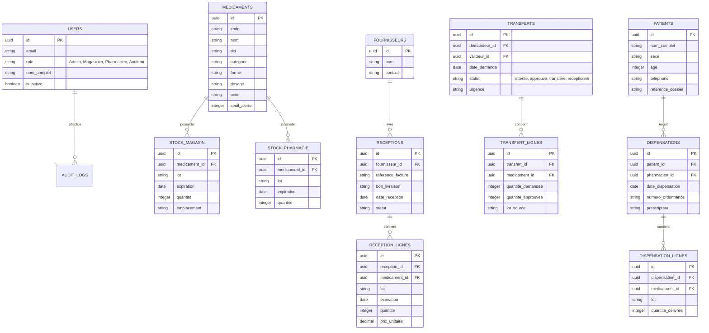

# Schéma de Base de Données

Ce diagramme illustre les relations entre les principales entités du système LogiHealth Stock.

```mermaid
erDiagram
    USERS ||--o{ AUDIT_LOGS : "effectue"
    USERS {
        uuid id PK
        string email
        string role "Admin, Magasinier, Pharmacien, Auditeur"
        string nom_complet
        boolean is_active
    }

    MEDICAMENTS ||--o{ STOCK_MAGASIN : "possède"
    MEDICAMENTS ||--o{ STOCK_PHARMACIE : "possède"
    MEDICAMENTS {
        uuid id PK
        string code
        string nom
        string dci
        string categorie
        string forme
        string dosage
        string unite
        integer seuil_alerte
    }

    FOURNISSEURS ||--o{ RECEPTIONS : "livre"
    FOURNISSEURS {
        uuid id PK
        string nom
        string contact
    }

    RECEPTIONS ||--o{ RECEPTION_LIGNES : "contient"
    RECEPTIONS {
        uuid id PK
        uuid fournisseur_id FK
        string reference_facture
        string bon_livraison
        date date_reception
        string statut
    }

    RECEPTION_LIGNES {
        uuid id PK
        uuid reception_id FK
        uuid medicament_id FK
        string lot
        date expiration
        integer quantite
        decimal prix_unitaire
    }

    STOCK_MAGASIN {
        uuid id PK
        uuid medicament_id FK
        string lot
        date expiration
        integer quantite
        string emplacement
    }

    STOCK_PHARMACIE {
        uuid id PK
        uuid medicament_id FK
        string lot
        date expiration
        integer quantite
    }

    TRANSFERTS ||--o{ TRANSFERT_LIGNES : "contient"
    TRANSFERTS {
        uuid id PK
        uuid demandeur_id FK
        uuid valideur_id FK
        date date_demande
        string statut "attente, approuve, transfere, receptionne"
        string urgence
    }

    TRANSFERT_LIGNES {
        uuid id PK
        uuid transfert_id FK
        uuid medicament_id FK
        integer quantite_demandee
        integer quantite_approuvee
        string lot_source
    }

    PATIENTS ||--o{ DISPENSATIONS : "reçoit"
    PATIENTS {
        uuid id PK
        string nom_complet
        string sexe
        integer age
        string telephone
        string reference_dossier
    }

    DISPENSATIONS ||--o{ DISPENSATION_LIGNES : "contient"
    DISPENSATIONS {
        uuid id PK
        uuid patient_id FK
        uuid pharmacien_id FK
        date date_dispensation
        string numero_ordonnance
        string prescripteur
    }

    DISPENSATION_LIGNES {
        uuid id PK
        uuid dispensation_id FK
        uuid medicament_id FK
        string lot
        integer quantite_delivree
    }
```
