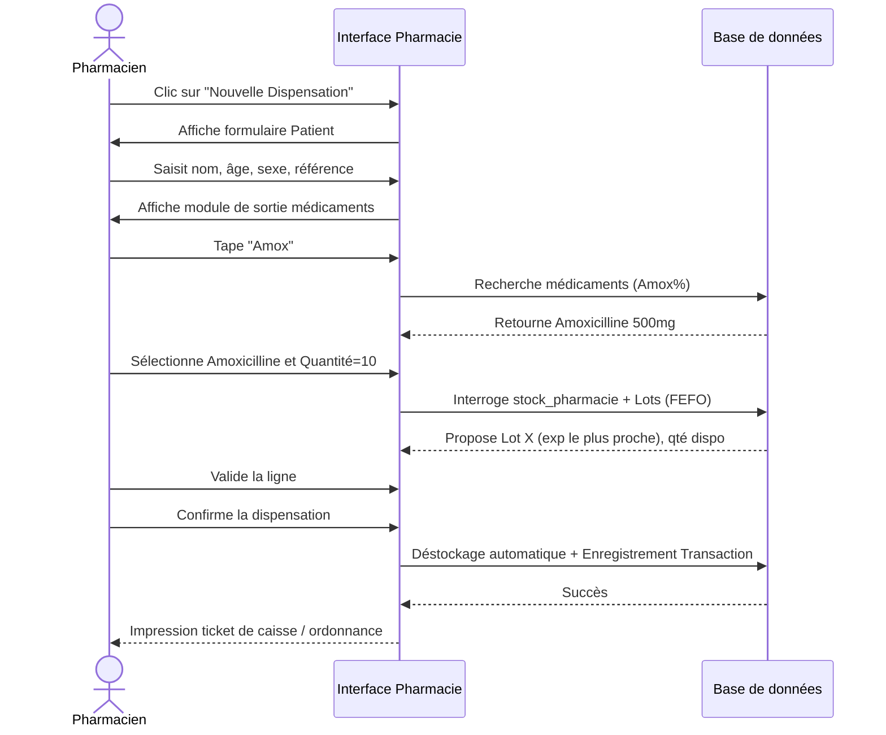
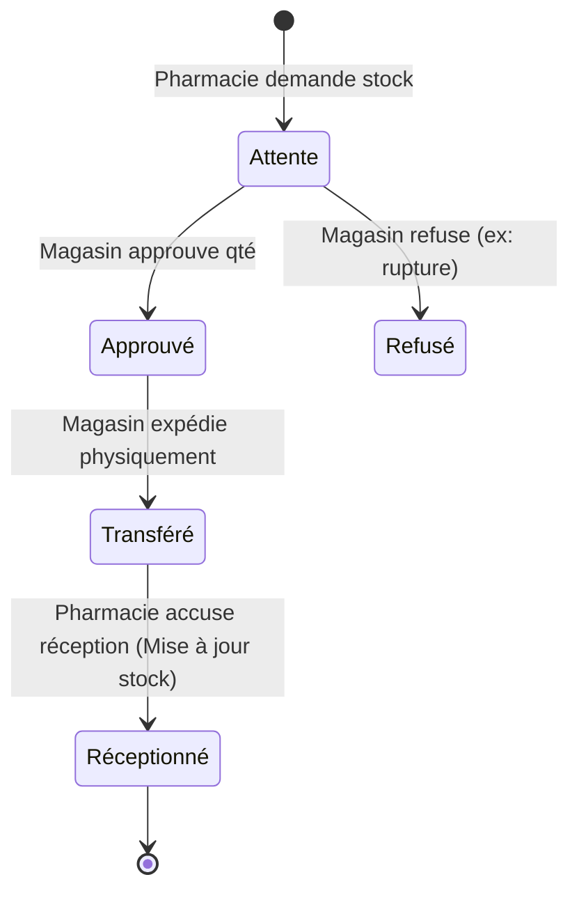

# User Flows (Flux d'Utilisateurs)

## 1. Flux de Dispensation Directe (Pharmacie)

```mermaid
sequenceDiagram
    actor Pharmacien
    participant UI as Interface Pharmacie
    participant DB as Base de données

    Pharmacien->>UI: Clic sur "Nouvelle Dispensation"
    UI->>Pharmacien: Affiche formulaire Patient
    Pharmacien->>UI: Saisit nom, âge, sexe, référence
    UI->>Pharmacien: Affiche module de sortie médicaments
    Pharmacien->>UI: Tape "Amox"
    UI->>DB: Recherche médicaments (Amox%)
    DB-->>UI: Retourne Amoxicilline 500mg
    Pharmacien->>UI: Sélectionne Amoxicilline et Quantité=10
    UI->>DB: Interroge stock_pharmacie + Lots (FEFO)
    DB-->>UI: Propose Lot X (exp le plus proche), qté dispo
    Pharmacien->>UI: Valide la ligne
    Pharmacien->>UI: Confirme la dispensation
    UI->>DB: Déstockage automatique + Enregistrement Transaction
    DB-->>UI: Succès
    UI-->>Pharmacien: Impression ticket de caisse / ordonnance
```

## 2. Flux de Transfert (Magasin -> Pharmacie)

```mermaid
stateDiagram-v2
    [*] --> Attente : Pharmacie demande stock
    Attente --> Approuvé : Magasin approuve qté
    Attente --> Refusé : Magasin refuse (ex: rupture)
    Approuvé --> Transféré : Magasin expédie physiquement
    Transféré --> Réceptionné : Pharmacie accuse réception (Mise à jour stock)
    Réceptionné --> [*]
```
